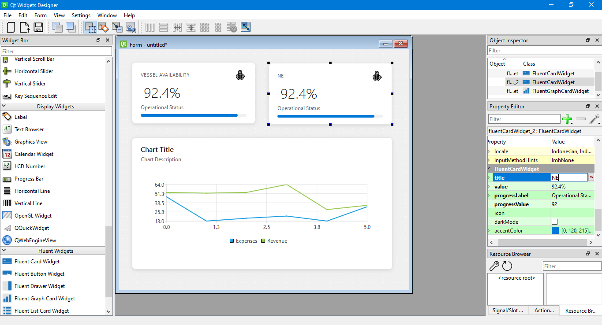

# Qt/C++ FluentWidgetsPlugin

Qt/C++ Widget Plugin featuring a Fluent-UI-inspired design system with full drag-and-drop support in the Qt Designer (.ui) environment.

## How to use?

1. Install the plugin, see INSTALL.md
2. A new group **Fluent Widgets** will appear in the widget box - left side panel of Qt .ui Designer
3. Drag and drop the desired widget
4. Change the property in the *property box*

## Lack of feature and Bug Reports

1. Read CONTRIBUTING.md to see how to easily add or edit a widget

## Credits

Created and maintained by **Alviansyah Maulana Iskandar**  
Inspired by the [Fluent UI design language](https://fluent2.microsoft.design/).
See the [contributors](https://github.com/alviansm/QtFluentWidgetPlugin/graphs/contributors) page for all project contributors.